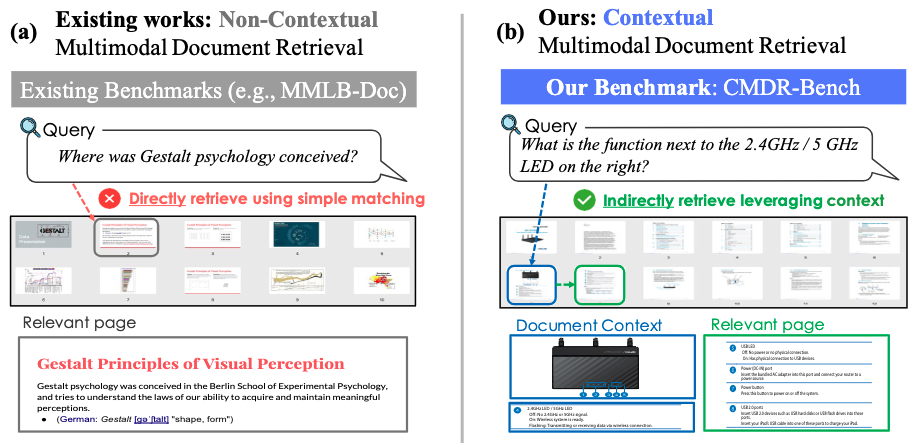

<div align="center">

# CMDR-Bench Pipeline Evaluation Framework

[](https://cmdr-bench.github.io/)
[](xxx)
[](https://huggingface.co/datasets/NTT-hil-insight/CMDR-Bench)
[](https://huggingface.co/datasets/NTT-hil-insight/CMDR-Synth)
[](https://eccv.ecva.net/)
</div>

This repository includes the CMDR-Bench introduced by the following paper: Ryota Tanaka, Taku Hasegawa, and Kyosuke Nishida. [CMDR: Contextual Multimodal Document Retrieval](xxx). In Proc. of ECCV 2026.

<p align="center"></p>


<a name="news"></a>
# 📢 News
- [2025/07]: The technical report, code, and data for CMDR-Bench are all available online.
- [2025/06]: 🎉 CMDR is accepted to ECCV 2026.

<a name="dataset creation"></a>
# 📚 Dataset 
[CMDR-Bench](https://huggingface.co/datasets/NTT-hil-insight/CMDR-Bench) meticulously designed to challenge and evaluate multimodal document retrieval models with tasks demanding multi-page reasoning and multimodal document retrieval. Additionally, [CMDR-Synth](https://huggingface.co/datasets/NTT-hil-insight/CMDR-Synth) provides a large scale synthetic query-page pairs for training contextual multimodal retrieval models. For more detailed information, please refer to our Hugging Face datasets:

- 🤗 [CMDR-Bench Dataset](https://huggingface.co/datasets/NTT-hil-insight/CMDR-Bench)
- 🤗 [CMDR-Synth Dataset](https://huggingface.co/datasets/NTT-hil-insight/CMDR-Synth)

<a name="installation"></a>
# ⚙️ Installation
1. Clone the repository.
2. Install dependencies as follows:
```bash
pip install -r requirements.txt
```

# 🤗 Download
1. Download SOTA multimodal document retrievers from huggingface
- ColPali
  - retriever adapter: [colpali-v1.1](https://huggingface.co/vidore/colpali-v1.1)
  - retrievver base VLM: [colpaligemma-3b-mix-448-base](https://huggingface.co/vidore/colpaligemma-3b-mix-448-base)
- ColQwen
  - retriever adapter: [colqwen2-v1.0](https://huggingface.co/vidore/colqwen2-v1.0)
  - retriever base VLM: [colqwen2-base](https://huggingface.co/vidore/colqwen2-base)
2. Place these checkpoints under [`./checkpoint/`](./checkpoint)

# 🔎 Inference commands of Retriever

## Encoding pages
You can infer using the command:
```bash
python encode_cmdr.py --model ColPali --encode query,page
```

## Searching pages and Evaluation
You can infer using the command:
```bash
python search_cmdr.py --model ColPali 
```
If the command runs successfully, the results will look like this:
```bash
Evaluation results:

=== ndcg@5 ===
Text Completion          : 39.1
Coreference Resolution   : 24.2
Structured Understanding : 30.2
Multi-hop Reasoning      : 35.4
Overall                  : 32.2

=== recall@5 ===
Text Completion          : 60.1
Coreference Resolution   : 37.6
Structured Understanding : 48.0
Multi-hop Reasoning      : 54.3
Overall                  : 50.0
```


<a name="license"></a>
# 📝 License
The code is released under the NTT License as found in the [LICENSE](./LICENSE) file.

<a name="citation"></a>
# ✒️ Citation
```bibtex
@inproceedings{tanaka2026cmdr,
  author    = {Ryota Tanaka and
               Taku Hasegawa and
               Kyosuke Nishida
               },
  title     = {CMDR: Contextual Multimodal Document Retrieval},
  booktitle = {ECCV},
  year      = {2026}
}
```

<a name="acknowledgement"></a>
# 📔 Acknowledgement
We have adapted code from [MMDocIR](https://github.com/MMDocRAG/MMDocIR), a flexible and efficient toolkit that supports inference for visual retrieval models.